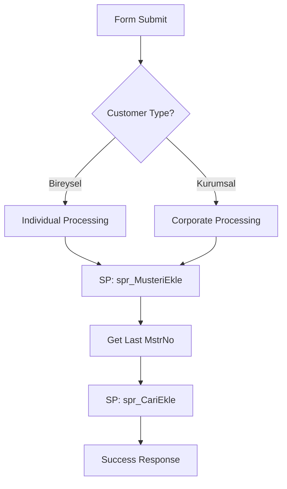

# 🏨 Gökçe Web - Pension Management System

## 📋 Project Overview

**Gökçe Web** is a comprehensive, modern pension/hotel management system built with Vue.js and NestJS, featuring **hybrid database architecture** that seamlessly combines the power of **Stored Procedures** with the flexibility of **ORM and Query Builder**.

### 🎯 Project Vision
A **modern, secure, and user-friendly** web-based management system for pension/hotel operations, including customer management, room/bed allocation, intelligent pricing, and comprehensive reporting capabilities.

### ✨ Current Implementation Status
- ✅ **Advanced Customer Registration Form** with 5-themed container architecture
- ✅ **Intelligent Pricing Algorithm** with economic optimization
- ✅ **Room & Accommodation Management** with real-time availability
- ✅ **Hybrid Database Approach** (SP + ORM + Query Builder)
- ✅ **Multi-Environment Schema Support** (Local `dbo` / Production `harunta`)
- ✅ **Responsive Container Synchronization** with dynamic height management
- 🔒 **TRANSACTION SAFETY IMPLEMENTATION** - Critical data integrity protection for all multi-step operations

---

## 🛠️ Technology Stack

### **Frontend - Vue.js Ecosystem**
- **Vue.js 3** (Composition API, TypeScript)
- **Quasar Framework** (Material Design, responsive UI components)
- **Pinia** (State management)
- **Vue Router** (Client-side routing)
- **Axios** (HTTP client with interceptors)
- **TypeScript** (Type safety and IntelliSense)

### **Backend - NestJS Ecosystem**
- **NestJS** (Node.js + TypeScript framework)
- **TypeORM** (SQL Server ORM with schema support)
- **Prisma** (Database migrations and schema management)
- **JWT Authentication** (Role-based authorization)
- **Custom Schema Management** (Environment-aware database connections)

### **Database - Hybrid Approach**
- **SQL Server** (Primary database)
- **Stored Procedures** (Critical business operations)
- **TypeORM Entities** (Simple CRUD operations)
- **Query Builder** (Dynamic search and filtering)
- **Environment Schema Resolution** (`dbo` ↔ `harunta`)

### **Architecture - Hybrid Database Strategy**

| Operation Type | Technology | Use Case |
|---------------|------------|----------|
| **Critical Business Logic** | Stored Procedures | Customer registration, cari creation |
| **Simple CRUD** | TypeORM | Lists, basic queries, pagination |
| **Dynamic Operations** | Query Builder | Search, filtering, complex conditions |

---

## ⚠️ CRITICAL DATABASE RULES

### **🔒 RULE #1: SQL DATABASE ARCHITECTURE IS IMMUTABLE**

The project uses the **`gokcepansiyon2010`** SQL Server database which is **ACTIVELY RUNNING IN PRODUCTION** on a remote server. 

**STRICT DEVELOPMENT RULES:**
- ❌ **NEVER** modify table names, column names, or data types
- ❌ **NEVER** change view definitions or stored procedure structures  
- ❌ **NEVER** alter schema names or database objects
- ❌ **NEVER** rename any SQL Server objects (tables, views, SPs, functions)
- ✅ **ALWAYS** use the exact SQL structure as provided
- ✅ **ALWAYS** maintain 1:1 compatibility with production database

### **🔒 RULE #2: TRANSACTION SAFETY IS MANDATORY**

**🚨 CRITICAL DATA INTEGRITY REQUIREMENT**

All multi-step database operations **MUST** use the `DatabaseTransactionService` to ensure data integrity and prevent corruption from network failures or partial operation completion.

**TRANSACTION SAFETY RULES:**
- ❌ **NEVER** execute multiple database operations sequentially without transactions
- ❌ **NEVER** combine Stored Procedures + ORM + Direct queries without transaction wrapper
- ❌ **NEVER** ignore the risk of partial operation completion
- ✅ **ALWAYS** use `DatabaseTransactionService.executeInTransaction()` for multi-step operations
- ✅ **ALWAYS** wrap operations that modify multiple tables in transactions
- ✅ **ALWAYS** ensure atomicity: ALL operations succeed or ALL operations fail

**WHY THIS RULE EXISTS:**
Multi-step database operations (customer registration, room changes, checkout) involve multiple table updates that MUST be atomic. Network failures or system crashes between operations can leave the database in an inconsistent state, causing data corruption and business logic failures.

**IMPLEMENTATION APPROACH:**
```typescript
// ❌ WRONG: Sequential operations without transaction
await this.service.createCustomer(data);
await this.service.createAccommodation(data);
await this.service.createTransaction(data);

// ✅ CORRECT: All operations in single transaction
await this.transactionService.executeInTransaction(async (queryRunner) => {
  await this.service.createCustomerWithTransaction(queryRunner, data);
  await this.service.createAccommodationWithTransaction(queryRunner, data);
  await this.service.createTransactionWithTransaction(queryRunner, data);
});
```

**PROTECTED OPERATIONS:**
- 🔒 Customer Registration (`/musteri-islem`)
- 🔒 Period Renewal (`/donem-yenileme`)
- 🔒 Customer Checkout (`/cikis-yap`)
- 🔒 Room Changes (`/direkt-oda-degisikligi`)

**⚡ REMEMBER: Data integrity is non-negotiable! Every multi-step operation MUST be transaction-safe!**

---

## 📊 DATA SORTING RULES

### **🔒 RULE #3: INTELLIGENT MULTI-CRITERIA SORTING**

**🚨 CRITICAL SORTING REQUIREMENT**

When multiple records have the same value for a given sorting criterion, they **MUST** be sorted among themselves by their **record creation timestamp** in descending order (newest first).

**SORTING RULES:**
- ✅ **PRIMARY SORTING**: Apply the specified sorting criterion first
- ✅ **SECONDARY SORTING**: For records with identical primary values, sort by record creation timestamp DESC
- ✅ **MULTIPLE CRITERIA**: When multiple sorting criteria are provided, apply them in the order specified by the code
- ✅ **TIMESTAMP RESPECT**: Respect the ASC/DESC direction of the primary criterion when applying timestamp sorting

**IMPLEMENTATION APPROACH:**

**Backend (SQL) Implementation:**
```sql
-- Example: Customer list sorted by room type, then by creation date DESC
SELECT * FROM tblKonaklama 
ORDER BY KnklmOdaTip ASC, KnklmGrsTrh DESC

-- Example: Debtors sorted by debt amount DESC, then by record date DESC
SELECT * FROM tblCari 
WHERE BorcTutari > 0 
ORDER BY BorcTutari DESC, CariTarih DESC
```

**Frontend (Quasar Table) Implementation:**
```typescript
// Table column definition with custom sort function
{
  name: 'KnklmOdaTip',
  label: 'Oda Tipi',
  field: 'KnklmOdaTip',
  sortable: true,
  sort: (a: string, b: string, rowA: any, rowB: any) => {
    // Primary sorting: room type
    if (a !== b) return a.localeCompare(b);
    // Secondary sorting: creation date DESC for identical room types
    const tarihA = new Date(rowA.KnklmGrsTrh.split('.').reverse().join('-'));
    const tarihB = new Date(rowB.KnklmGrsTrh.split('.').reverse().join('-'));
    return tarihB.getTime() - tarihA.getTime(); // DESC sorting
  }
}
```

**WHY THIS RULE EXISTS:**
When users sort data by a specific criterion, they expect to see the most recent records first when multiple items have the same value. This provides a consistent and intuitive user experience across all tables and lists.

**PROTECTED TABLES:**
- 📊 Customer List (sorted by room type, accommodation type, etc.)
- 📊 Debtor List (sorted by debt amount, company name, etc.)
- 📊 Creditor List (sorted by credit amount, company name, etc.)
- 📊 Accommodation History (sorted by accommodation number, dates, etc.)

**⚡ REMEMBER: Always provide secondary timestamp sorting for identical primary values!**

---

## 🚀 Key Features

### **Customer Management**
- ✅ **Advanced Registration Form** with 5-themed container system
- ✅ **Bireysel & Kurumsal** customer types with automatic field management
- ✅ **Corporate Account Integration** with automatic cari creation
- ✅ **TC Kimlik validation** and duplicate checking
- ✅ **Company data synchronization** with automatic form population

### **Room & Accommodation Management**
- ✅ **Real-time room availability** based on room type selection
- ✅ **Dynamic pricing calculation** with intelligent algorithms
- ✅ **Economic optimization** for accommodation duration
- ✅ **Automatic pricing type determination** (GÜNLÜK/HAFTALIK/AYLIK)

### **Intelligent Pricing System**
- ✅ **Advanced pricing algorithm** with economic optimization
- ✅ **Duration-based calculations** (1-30 days supported)
- ✅ **Automatic cost optimization** selecting cheapest option
- ✅ **Real-time price updates** on form changes

### **Frontend Architecture**
- ✅ **5-Container themed system** with responsive design
- ✅ **Dynamic height synchronization** between containers
- ✅ **Desktop side-by-side** and mobile stacked layouts
- ✅ **Real-time form validation** with Vue 3 reactivity

### **Backend Architecture**
- ✅ **Hybrid database approach** (SP + ORM + Query Builder)
- ✅ **Environment-aware schema management** (local ↔ production)
- ✅ **Automatic schema resolution** based on environment variables
- ✅ **Performance-optimized** database operations

---

## 🏗️ Project Structure

```
gokceweb/
├── backend/                          # NestJS API with Hybrid Database Approach
│   ├── src/
│   │   ├── database/
│   │   │   └── database-config.service.ts    # Dynamic schema management
│   │   ├── entities/
│   │   │   ├── musteri.entity.ts            # Customer entity
│   │   │   ├── cari.entity.ts               # Account entity  
│   │   │   └── oda-yatak.entity.ts          # Room & bed entity
│   │   ├── dto/
│   │   │   └── create-musteri.dto.ts        # Customer registration DTO
│   │   ├── musteri/
│   │   │   ├── musteri.controller.ts        # API endpoints
│   │   │   ├── musteri.service.ts           # Business logic (Hybrid)
│   │   │   └── musteri.module.ts            # Module configuration
│   │   └── main.ts                          # Application entry point
│   ├── prisma/
│   │   ├── schema.prisma                    # Database schema
│   │   └── migrations/                      # Database migrations
│   ├── SCHEMA_MIGRATION_GUIDE.md           # Schema configuration guide
│   └── package.json
├── frontend/                         # Quasar + Vue.js Frontend
│   ├── src/
│   │   ├── pages/
│   │   │   ├── musteri-islem.vue            # Main customer registration form
│   │   │   ├── musteri-islem-BACKUP-v1.0.vue  # Form backup v1
│   │   │   ├── musteri-islem-BACKUP-v2.0.vue  # Form backup v2
│   │   │   ├── IndexPage.vue                # Dashboard
│   │   │   └── LoginPage.vue                # Authentication
│   │   ├── components/
│   │   │   ├── models.ts                    # TypeScript interfaces
│   │   │   └── EssentialLink.vue            # Navigation component
│   │   ├── layouts/
│   │   │   └── MainLayout.vue               # Main application layout
│   │   ├── boot/
│   │   │   └── axios.ts                     # Axios configuration
│   │   ├── stores/                          # Pinia stores
│   │   ├── router/                          # Vue Router configuration
│   │   └── css/                             # Styling files
│   ├── quasar.config.ts                     # Quasar framework configuration
│   └── package.json
└── README.md                                # Main project documentation
```

---

## 🚀 Quick Start Guide

### **Prerequisites**
- Node.js 18+ and npm
- SQL Server database (local for development, remote for production)
- Environment variables configured for schema management

### **1. Backend Setup (NestJS + Hybrid Database)**

```bash
cd backend
npm install

# Set environment variables for schema management
# Development:
set DB_TABLE_SCHEMA=dbo
set DB_SP_SCHEMA=dbo

# Production:
set DB_TABLE_SCHEMA=harunta
set DB_SP_SCHEMA=dbo

# Start development server
npm run start:dev
```

**Backend Features:**
- ✅ Hybrid database operations (SP + ORM + Query Builder)
- ✅ Environment-aware schema resolution
- ✅ Customer registration with automatic cari creation
- ✅ Room management and pricing APIs
- ✅ Corporate account management

### **2. Frontend Setup (Quasar + Vue.js)**

```bash
cd frontend
npm install

# Start development server with hot-reload
npm run dev
# or
quasar dev
```

**Frontend Features:**
- ✅ 5-container themed customer registration form
- ✅ Intelligent pricing calculations
- ✅ Real-time form validation
- ✅ Responsive design with container height synchronization
- ✅ Dynamic room availability selection

### **3. Database Schema Management**

The application automatically handles schema differences between environments:

**Development Environment:**
- Tables: `dbo.tblMusteri`, `dbo.tblOdaYatak`, etc.
- Stored Procedures: `dbo.spr_MusteriEkle`, `dbo.spr_CariEkle`

**Production Environment:**
- Tables: `harunta.tblMusteri`, `harunta.tblOdaYatak`, etc.
- Stored Procedures: `dbo.spr_MusteriEkle`, `dbo.spr_CariEkle` (same schema)

### **4. Application Access**

Once both servers are running:
- **Frontend**: `http://localhost:9000`
- **Backend API**: `http://localhost:3000`
- **API Endpoints**: See backend README for complete API documentation

---

## 🎮 User Workflow Example

### **Customer Registration Process**

1. **Form Access:** Navigate to customer registration form with 5-themed container layout
2. **Customer Type Selection:** Choose between "Bireysel" or "Kurumsal" with automatic field management
3. **Company Data (if Corporate):** Auto-population from existing company database
4. **Room Selection:** Choose room type → auto-populate available rooms
5. **Duration & Pricing:** Enter accommodation duration → intelligent pricing calculation
6. **Automatic Optimization:** System selects most economical pricing type (GÜNLÜK/HAFTALIK/AYLIK)
7. **Validation & Submit:** Real-time validation → backend processing with SP execution
8. **Account Creation:** Automatic cari account creation with appropriate business logic

### **Backend Processing Flow**



---

## 💡 Development Best Practices

### **Hybrid Database Approach Guidelines**

1. **Critical Operations → Stored Procedures**
   - Customer registration with business rules
   - Multi-table transactions
   - Complex business logic operations

2. **Simple Operations → TypeORM**
   - Basic CRUD operations
   - List queries with pagination
   - Straightforward data retrieval

3. **Dynamic Operations → Query Builder**
   - Advanced search with multiple filters
   - Conditional query building
   - Complex JOIN operations

### **Frontend Development Guidelines**

1. **Container Architecture**
   - Keep related fields in themed containers
   - Maintain consistent styling across containers
   - Implement proper height synchronization

2. **Reactive Programming**
   - Use Vue 3 Composition API with TypeScript
   - Implement watch functions for form reactivity
   - Handle async operations with proper error handling

3. **Performance Optimization**
   - Cache API responses to reduce backend load
   - Implement proper loading states
   - Use debouncing for expensive operations

### **Schema Management Guidelines**

1. **Environment Configuration**
   - Set correct schema variables for each environment
   - Verify schema resolution in console logs
   - Test database operations after schema changes

2. **Code Organization**
   - Use DatabaseConfigService for all database operations
   - Implement proper error handling for schema issues
   - Document schema requirements for new features

---

## 📚 Documentation & Resources

### **Project Documentation**
- **Backend Documentation**: `backend/README.md` - Comprehensive backend guide with hybrid database approach
- **Frontend Documentation**: `frontend/README.md` - Frontend architecture and component documentation  
- **Schema Migration Guide**: `backend/SCHEMA_MIGRATION_GUIDE.md` - Environment schema configuration
- **🔒 Transaction Safety Checklist**: `TRANSACTION-SAFETY-CHECKLIST.md` - **CRITICAL** data integrity guidelines for all developers

### **Technology Resources**
- [Vue.js 3 Official Documentation](https://vuejs.org/)
- [Quasar Framework Documentation](https://quasar.dev/)
- [NestJS Official Documentation](https://docs.nestjs.com/)
- [TypeORM Documentation](https://typeorm.io/)
- [Pinia State Management](https://pinia.vuejs.org/)
- [SQL Server Documentation](https://learn.microsoft.com/en-us/sql/sql-server/)

---

## ❓ Frequently Asked Questions

**Q: How does the hybrid database approach work?**  
A: The system uses Stored Procedures for critical operations (customer registration, cari creation), TypeORM for simple CRUD operations, and Query Builder for dynamic searches. Schema names are automatically resolved based on environment variables.

**Q: What changes when deploying from development to production?**  
A: Only environment variables need to be updated (`DB_TABLE_SCHEMA=harunta` for production). The code automatically adapts to the correct schema without any code changes.

**Q: How is the intelligent pricing system implemented?**  
A: The frontend uses an advanced algorithm that calculates the most economical accommodation type based on duration, comparing daily, weekly, and monthly rates to find the cheapest option automatically.

**Q: How does container height synchronization work?**  
A: The frontend uses ResizeObserver API with Vue 3 lifecycle hooks to monitor main container height changes and dynamically synchronize the extra information container height for perfect visual alignment.

**Q: How is corporate vs individual customer handling implemented?**  
A: The form automatically shows/hides relevant fields based on customer type selection, with automatic company data population and synchronized cari account creation in the backend.

---

## 🎯 Development Roadmap

### **Current Status (Phase 1) ✅**
- [x] Advanced customer registration form with 5-container architecture
- [x] Intelligent pricing algorithm with economic optimization
- [x] Room availability management with real-time updates
- [x] Hybrid database approach implementation
- [x] Multi-environment schema support
- [x] Corporate account management

### **Next Phase (Phase 2) 🔄**
- [ ] User authentication and role-based authorization
- [ ] Dashboard with occupancy analytics
- [ ] Staff management module
- [ ] Financial management (payments, debts, credits)
- [ ] Reporting system with visual analytics
- [ ] Mobile responsive optimizations

### **Future Phases (Phase 3+) 🚀**
- [ ] Integration with external systems (HotelRunner, POS, etc.)
- [ ] Advanced reporting and analytics
- [ ] Multi-language support
- [ ] Mobile application (Quasar Capacitor)
- [ ] PWA functionality

---

## 🤝 Contributing

This project follows best practices for Vue.js and NestJS development. When contributing:

1. **Follow the hybrid database approach** - use appropriate technology for each operation type
2. **Maintain schema compatibility** - test in both development and production environments
3. **Update documentation** - keep README files current with any changes
4. **Test thoroughly** - especially pricing calculations and form validations

---

## 📄 License

This project is licensed under the MIT License. 

---

## 💬 Support

For questions about the hybrid database approach, pricing algorithms, or container architecture, refer to the detailed documentation in each module's README file.

## Port Yönetimi ve Geliştirme Ortamı

### 🚀 Otomatik Geliştirme Ortamı

#### En Kolay Yöntem: Tek Tıkla Başlatma
```batch
# Tüm portları otomatik temizler ve servisleri başlatır
.\start-dev.bat
```

#### Manuel Başlatma (Otomatik Port Temizleme ile)
```powershell
# Backend (otomatik port temizleme ile)
cd backend
npm run start:dev

# Frontend (otomatik port temizleme ile)
cd frontend
npm run dev
```

#### Sadece Port Temizleme
```powershell
# PowerShell script ile
powershell -ExecutionPolicy Bypass -File ".\kill-ports.ps1"

# Veya manuel
netstat -ano | findstr :3000   # Backend
netstat -ano | findstr :9000   # Frontend
taskkill /PID [PROCESS_ID] /F
```

### Kullanılan Portlar
- **Backend**: 3000
- **Frontend**: 9000 (sabit port, strictPort: true)

### Hızlı Port Temizleme Komutu
```powershell
# Tüm Node.js process'lerini kapat (DİKKAT: Diğer Node.js uygulamaları da kapanır)
taskkill /IM node.exe /F
taskkill /IM "node.exe" /F
```

## Proje Yapısı

```
gokceweb/
├── backend/          # NestJS API
├── frontend/         # Vue.js + Quasar UI
└── README.md
```

## Özellikler

- **Dashboard**: Müşteri konaklama durumları
- **Müşteri İşlemleri**: Yeni müşteri kaydı ve konaklama işlemleri
- **Dönem Yenileme**: Mevcut müşteriler için dönem uzatma
- **Oda Yönetimi**: Oda ve yatak durumu takibi
- **Responsive Design**: Mobil ve masaüstü uyumlu

## Teknolojiler

### Backend
- NestJS
- TypeORM
- SQL Server
- TypeScript

### Frontend
- Vue.js 3
- Quasar Framework
- TypeScript
- Axios

## Geliştirme Notları

1. **Otomatik port temizleme** artık npm scripts'e entegre
2. `start-dev.bat` ile tek tıkla geliştirme ortamı
3. `npm run dev` ve `npm run start:dev` artık otomatik port temizler
4. `strictPort: true` ile port çakışması engellenir
5. PowerShell script ile gelişmiş port yönetimi
